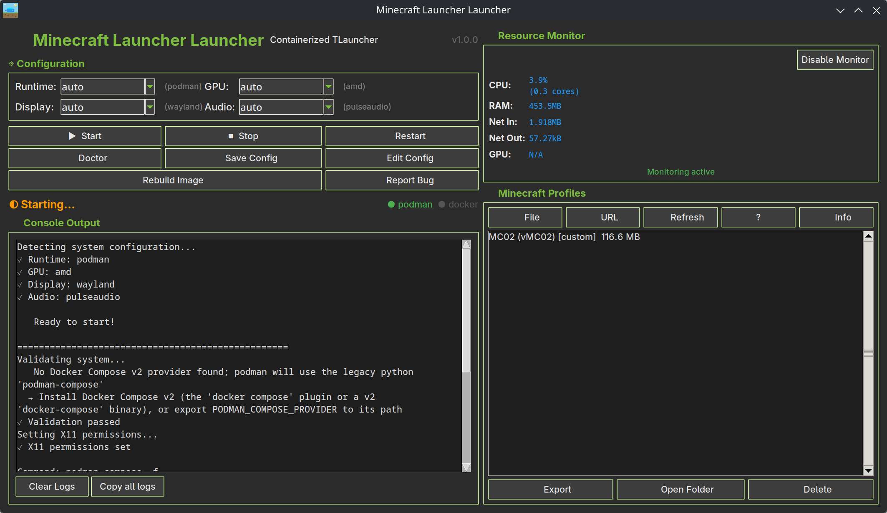

# Minecraft Launcher Launcher


**A launcher for TLauncher** - Run Minecraft safely in an isolated container with full GPU acceleration, audio support, and automatic system detection.



## What Is This?

This project lets you run **Minecraft via TLauncher** inside a container (like a lightweight virtual machine) that:

✅ **Isolates Minecraft** from your main system (safer, cleaner)
✅ **Auto-detects** your GPU, display server, and audio system
✅ **Works out-of-the-box** with NVIDIA/AMD GPUs
✅ **Provides both GUI and CLI** interfaces
✅ **Runs on Linux and Windows** (via WSL2)

---

## Three Ways to Run

### 🎮 Option 1: Easy Launcher (Recommended)

**Best for:** Everyone, especially non-technical users

A Python wrapper with graphical interface and automatic detection.

```bash
./minecraft.py          # Opens GUI window
./minecraft.py start    # Or use terminal

# Add to application menu:
./create-shortcut.sh
```

**Features:**

- Double-click to launch
- Auto-detects everything
- One-click start/stop buttons
- Save your preferences
- Real-time log display

👉 **See:** [Quick Start for Linux](#-linux-users) | [Quick Start for Windows](#-windows-users-wsl2)

---

### 🐳 Option 2: Direct Container Commands

**Best for:** Users comfortable with Docker/Podman

Use compose commands directly without the wrapper.

```bash
# Example: Podman + NVIDIA + X11 + Audio
xhost +SI:localuser:$USER
podman compose -f compose.base.yaml -f compose.podman.yaml \
  -f compose.nvidia.yaml -f compose.x11.yaml \
  -f compose.audio-pulseaudio.yaml up
```

👉 **See:** [Manual Compose Guide](RUNBOOK-MANUAL.md)

---

### ⚙️ Option 3: Custom Configuration

**Best for:** Advanced users who want full control

Combine modular compose files for your exact setup.

```bash
# Mix and match:
# - Runtime: podman or docker
# - GPU: nvidia or amd
# - Display: x11 or wayland
# - Audio: pulseaudio or none

docker compose -f compose.base.yaml -f compose.docker.yaml \
  -f compose.amd.yaml -f compose.wayland.yaml \
  -f compose.audio-none.yaml up
```

---

## Quick Start

### 🐧 Linux Users

**1. Install dependencies:**

```bash
# Fedora/RHEL/CentOS
sudo dnf install podman python3-pyyaml python3-tkinter

# Ubuntu/Debian
sudo apt install podman python3-yaml python3-tk

# Arch
sudo pacman -S podman python-yaml tk
```

**2. Clone and build:**

```bash
cd ~/Games
git clone https://github.com/thereisnotime/tlauncher-launcher Minecraft
cd Minecraft
podman build -t tlauncher-java .
```

**3. Launch:**

```bash
./minecraft.py
```

👉 **See also:** [Manual Compose Guide](RUNBOOK-MANUAL.md) for direct container commands

---

### 🪟 Windows Users (WSL2)

**1. Install WSL2 with Ubuntu:**

```powershell
wsl --install -d Ubuntu
```

**2. Inside WSL2, install Docker Desktop:**

Follow: <https://docs.docker.com/desktop/wsl/>

**3. Clone and build:**

```bash
cd ~
git clone https://github.com/thereisnotime/tlauncher-launcher Minecraft
cd Minecraft
docker build -t tlauncher-java .
```

**4. Set up X server (VcXsrv or Xming):** See detailed guide below.

**5. Set DISPLAY variable:**

```bash
export DISPLAY=$(cat /etc/resolv.conf | grep nameserver | awk '{print $2}'):0
```

**6. Launch:**

```bash
./minecraft.py
```

**Optional: Create Windows desktop shortcut:**

```powershell
# From PowerShell (run as Administrator):
.\create-shortcut.ps1
```

👉 **See also:** [Manual Compose Guide](RUNBOOK-MANUAL.md) for advanced configuration

---

## How It Works

### Architecture

```text
┌─────────────────────────────────────────┐
│  Your Computer (Host)                   │
│                                         │
│  ┌──────────────────────────────────┐  │
│  │  Container (Isolated)            │  │
│  │                                  │  │
│  │  ├─ TLauncher                   │  │
│  │  ├─ Minecraft                   │  │
│  │  ├─ Java Runtime                │  │
│  │  └─ Your Worlds & Mods          │  │
│  │                                  │  │
│  └──────────────────────────────────┘  │
│         ▲                                │
│         │ Shared:                        │
│         ├─ GPU (for graphics)           │
│         ├─ Audio (for sound)            │
│         └─ Display (for window)         │
└─────────────────────────────────────────┘
```

### File Organization

```text
Minecraft/
├── minecraft.py              # 🚀 Launcher (GUI + CLI)
├── compose.*.yaml            # 🐳 Container configurations
├── Containerfile             # 📦 Container image recipe
├── entrypoint.sh             # ⚙️  Startup script
│
├── launcher/                 # TLauncher app (auto-downloads)
├── home/                     # 🎮 Your worlds, mods, saves
└── tlauncher-data/          # 📝 TLauncher cache & logs
```

Your Minecraft data is stored in `./home/` - back this up regularly!

---

## Features

### 🎮 Easy Launcher Features

**GUI Mode** (graphical window):

- Auto-detects your system configuration
- Dropdown menus to override settings
- One-click start/stop/restart buttons
- Real-time log display
- Real-time resource monitoring (CPU, RAM, Network, GPU)
- **Profile management** - Import/export Minecraft versions as ZIP files
- Built-in system validation ("Doctor" button)
- Save preferences for next launch

**CLI Mode** (terminal):

- Rich terminal output with colors and tables
- Interactive confirmation menus
- Commands: start, stop, restart, logs, status, doctor, **stats**, **profiles**
- **Profile management** - List, export, import, delete profiles from terminal
- **Resource monitoring** - Real-time CPU, RAM, Network, GPU stats
- Flag-based overrides: `--runtime docker --gpu amd`
- Works over SSH

### 🔒 Security

- Read-only container filesystem
- No privileged containers
- Isolated from host system
- All capabilities dropped
- Resource limits (CPU, memory, processes)

### 🎯 Auto-Detection

Automatically detects:

- Container runtime (Podman or Docker)
- GPU type (NVIDIA or AMD/Intel)
- Display server (X11 or Wayland)
- Audio system (PulseAudio/PipeWire or none)

### 🔧 Customization

Override any detection:

- **GUI:** Change dropdowns from "auto" to specific values
- **CLI:** Use flags: `--runtime docker --gpu amd --display wayland`
- **Config file:** Save preferences to `~/.config/minecraft-launcher/`

---

## Platform Support

| Platform        | Container Runtime | Display | Audio      | GPU    | Status          |
|-----------------|-------------------|---------|------------|--------|-----------------|
| Linux (X11)     | Podman, Docker    | ✅      | ✅         | ✅     | Full support    |
| Linux (Wayland) | Podman, Docker    | ✅      | ✅         | ✅     | Needs testing   |
| Windows (WSL2)  | Docker Desktop    | ✅      | ⚠️ Limited | ✅     | Needs testing   |
| macOS           | Docker Desktop    | ❌      | ❌         | ❌     | Not supported   |

---

## Feature Comparison

### Core Features

| Feature                          | GUI | CLI | Status |
|----------------------------------|-----|-----|--------|
| Auto-detect system config        | ✅  | ✅  | ✅     |
| Manual config override           | ✅  | ✅  | ✅     |
| Save preferences                 | ✅  | ✅  | ✅     |
| Container start/stop/restart     | ✅  | ✅  | ✅     |
| Real-time logs                   | ✅  | ✅  | ✅     |
| System validation (doctor)       | ✅  | ✅  | ✅     |
| Resource monitoring (CPU/RAM/GPU)| ✅  | ✅  | ✅     |
| Profile import/export            | ✅  | ✅  | ✅     |
| Profile management               | ✅  | ✅  | ✅     |
| Existing container detection     | ✅  | ✅  | ✅     |

### Container Runtime Support

| Runtime        | Status      | Notes                              |
|----------------|-------------|------------------------------------|
| Podman         | ✅ Tested   | Rootless mode, recommended         |
| Docker         | ✅ Tested   | Works with both rootful/rootless   |
| Podman Desktop | ⚠️ Untested | Should work, not verified          |
| Docker Desktop | ⚠️ Untested | Should work on WSL2                |

### GPU Support

| GPU Type       | Status      | Notes                              |
|----------------|-------------|------------------------------------|
| NVIDIA         | ✅ Tested   | Full acceleration, stats monitoring|
| AMD/Intel      | ⚠️ Untested | Device passthrough configured      |
| No GPU         | ✅ Works    | Software rendering fallback        |

### Display Server Support

| Display Server | Status      | Notes                              |
|----------------|-------------|------------------------------------|
| X11            | ✅ Tested   | Full support, auto xhost setup     |
| Wayland        | ⚠️ Untested | Configuration exists, needs testing|
| X11 forwarding | ✅ Works    | Over SSH with proper DISPLAY setup |

### Audio Support

| Audio System   | Status      | Notes                              |
|----------------|-------------|------------------------------------|
| PulseAudio     | ✅ Tested   | Full audio support                 |
| PipeWire       | ✅ Works    | PulseAudio compatibility mode      |
| No audio       | ✅ Works    | Can run without audio              |

---

## Roadmap

### Planned Features

#### 🔄 Multiple Instance Support

- [ ] Support running multiple TLauncher instances simultaneously
- [ ] Separate container names and data directories per instance
- [ ] GUI selector for switching between instances
- [ ] CLI `--instance` flag for managing specific instances
- [ ] Profile isolation between instances

#### 🧪 Platform Testing

- [ ] **Windows WSL2**: Full testing with Docker Desktop
  - [ ] Display server integration (VcXsrv/Xming)
  - [ ] Audio passthrough testing
  - [ ] GPU acceleration verification
  - [ ] Desktop shortcut creation (PowerShell script)
- [ ] **AMD GPU**: Testing on AMD/Intel graphics
  - [ ] Device passthrough validation
  - [ ] Performance benchmarking vs NVIDIA
  - [ ] Resource monitoring integration
- [ ] **Wayland**: Full testing on Wayland display server
  - [ ] XWayland compatibility
  - [ ] Native Wayland socket sharing
  - [ ] Performance comparison with X11

#### ✨ Enhancements

- [ ] Profile backup scheduler (automatic ZIP exports)
- [ ] Mod pack auto-updater integration
- [ ] Server mode (headless dedicated server container)
- [ ] Per-profile resource limits (RAM, CPU caps)
- [ ] Dark/light theme toggle for GUI
- [ ] Profile sync to cloud storage (optional)
- [ ] Container health monitoring with alerts
- [ ] Crash report analyzer
- [ ] Automatic log rotation and cleanup
- [ ] Profile templates (modpack presets)

#### 📦 Distribution

- [ ] Pre-built container images on Docker Hub
- [ ] Flatpak packaging for easy installation
- [ ] AppImage for portable Linux deployment
- [ ] Snap package for Ubuntu/derivatives
- [ ] AUR package for Arch Linux
- [ ] Windows installer (with WSL2 setup)

#### 🔧 Technical Improvements

- [ ] Compose file validation on startup
- [ ] Container image auto-update checker
- [ ] Sandboxing improvements (seccomp profiles)
- [ ] Network isolation options
- [ ] Automatic version migration tools
- [ ] Built-in backup/restore functionality
- [ ] Performance profiling mode
- [ ] Multi-language support (i18n)

### Contribution Welcome

Want to help? These areas need testing and feedback:

- **Wayland users**: Test `compose.wayland.yaml` configuration
- **AMD/Intel GPU users**: Validate GPU passthrough and performance
- **Windows users**: Test WSL2 setup and report issues
- **Docker users**: Verify Docker-specific configurations
- **Modpack creators**: Test profile import/export with large mod collections

---

## Documentation

### For Users

- **[Quick Start - Linux](#-linux-users)** - Step-by-step Linux installation
- **[Quick Start - Windows](#-windows-users-wsl2)** - Step-by-step Windows (WSL2) installation
- **[RUNBOOK-MANUAL.md](RUNBOOK-MANUAL.md)** - Manual compose commands reference

### For Developers

- **[WRAPPER-STRUCTURE.md](WRAPPER-STRUCTURE.md)** - Launcher architecture and code structure
- **[TLAUNCHER-STRUCTURE.md](TLAUNCHER-STRUCTURE.md)** - Minecraft data organization

#### Development Workflow

```bash
# Install development dependencies (includes ruff linter/formatter)
make install-dev

# Format code
make format

# Check formatting without modifying files
make format-check

# Run linter
make lint

# Run linter with auto-fix
make lint-fix

# Run tests (Python syntax validation)
make test

# Build container image
make build         # Docker
make build-podman  # Podman

# Run all CI checks locally
make ci

# Clean up cache files
make clean

# Show all available targets
make help
```

---

## Troubleshooting

### No display window appears

**Linux:**

```bash
# For X11, grant access:
xhost +SI:localuser:$USER
./minecraft.py start
```

**Windows WSL2:**

```bash
# Ensure X server (VcXsrv) is running
# Set DISPLAY variable:
export DISPLAY=$(cat /etc/resolv.conf | grep nameserver | awk '{print $2}'):0
```

### No GPU acceleration

```bash
# Check detection:
./minecraft.py doctor

# Verify devices exist:
ls -la /dev/nvidia*   # For NVIDIA
ls -la /dev/dri       # For AMD/Intel
```

### No audio

```bash
# Check if audio system is running:
pactl info

# Verify socket exists:
ls -la /run/user/$(id -u)/pulse/native

# Try without audio:
./minecraft.py start --audio none
```

### Container fails to start

```bash
# Run system check:
./minecraft.py doctor

# Check compose files exist:
ls -la compose.*.yaml

# View detailed errors:
./minecraft.py start --yes
```

---

## FAQ

**Q: Do I need to install Minecraft separately?**
A: No! TLauncher downloads and manages Minecraft automatically.

**Q: Where are my worlds saved?**
A: In `./home/saves/` on your host machine (not inside the container).

**Q: Can I use mods?**
A: Yes! Place mods in `./home/mods/` - see [TLAUNCHER-STRUCTURE.md](TLAUNCHER-STRUCTURE.md)

**Q: Is this legal?**
A: Yes, TLauncher is a third-party launcher. Own a Minecraft account for full features.

**Q: Does this work with vanilla Minecraft?**
A: Yes, TLauncher supports vanilla Minecraft and modded versions (Forge, Fabric).

**Q: Can I run multiple instances?**
A: Yes, copy the entire directory and run each separately.

**Q: How do I update Minecraft?**
A: TLauncher handles updates automatically when you launch it.

**Q: How do I share Minecraft versions between computers?**
A: Use the **Profile Import/Export** feature in GUI or CLI:

**GUI:**

1. Select a profile in the "Minecraft Profiles" panel
2. Click "📤 Export" to save it as a `.mcprofile.zip` file
3. Transfer the ZIP to another computer
4. Click "📥 Import" to load it into TLauncher

**CLI:**

```bash
# List profiles
./minecraft.py profiles list

# Export a profile
./minecraft.py profiles export MC02

# Import a profile
./minecraft.py profiles import MC02_1.21.mcprofile.zip

# Delete a profile
./minecraft.py profiles delete OldVersion
```

The exported ZIP includes the version files, mods, and configuration.

**Q: How do I monitor resource usage?**
A: Use the **Resource Monitor** in GUI or CLI:

**GUI:** Click "Enable Monitor" in the Resource Monitor panel

**CLI:**

```bash
./minecraft.py stats  # Shows live CPU, RAM, Network, GPU usage
```

**Q: A mod fails to load with `FileWatcher$WatchingException: Failed to watch path`?**
A: This happens when the system runs out of **inotify** instances. Forge mods use file watchers for config hot-reloading, and the default Linux limit (128 instances) is too low for heavily modded packs. Fix it by increasing the limit:

```bash
# Apply immediately (resets on reboot):
sudo sysctl -w fs.inotify.max_user_instances=256

# Make it permanent:
echo 'fs.inotify.max_user_instances=256' | sudo tee /etc/sysctl.d/99-inotify.conf
sudo sysctl --system
```

Then recreate the container and try again.

**Q: What if I don't want the launcher wrapper?**
A: Use compose commands directly - see [RUNBOOK-MANUAL.md](RUNBOOK-MANUAL.md)

---

## Contributing

Found a bug or have a suggestion? Open an issue or pull request!

---

## License

This setup is provided as-is. Minecraft and TLauncher are separate projects with their own licenses.

---

## Credits

- **Minecraft** by Mojang Studios
- **TLauncher** by TLauncher Team
- **Container setup** by this repository's contributors

---

## Getting Help

1. **System check:** Run `./minecraft.py doctor` first
2. **Check logs:** Look in `./tlauncher-data/logs/`
3. **Platform guides:** [Linux](#-linux-users) | [Windows](#-windows-users-wsl2)
4. **Issues:** Open a GitHub issue with doctor output

---

**Ready to play?** → [Linux Quick Start](#-linux-users) | [Windows Quick Start](#-windows-users-wsl2)
